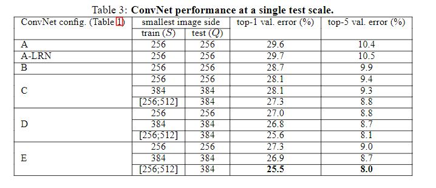
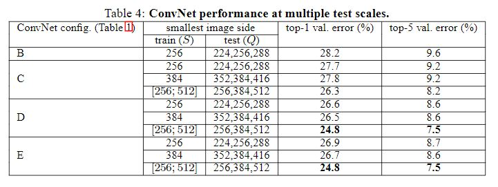
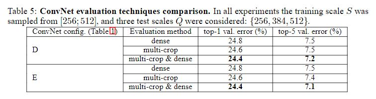
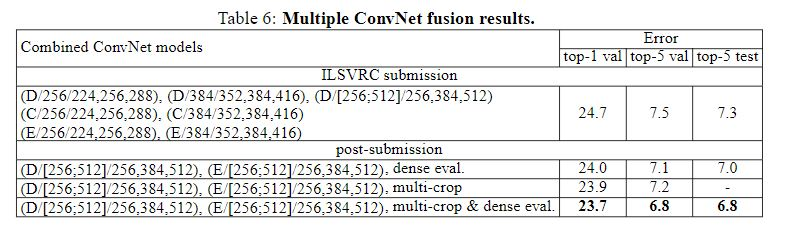
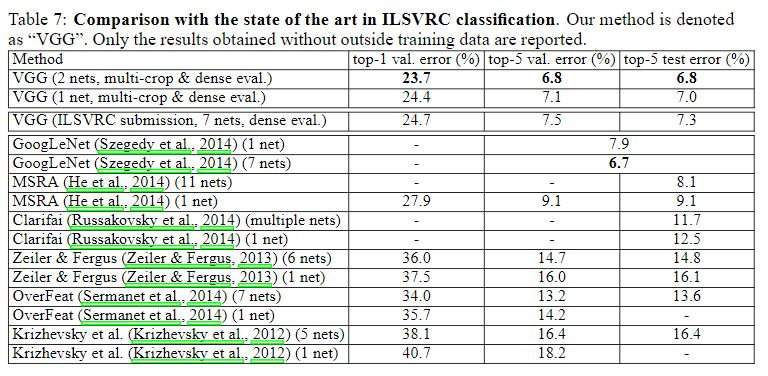

## 翻译论文 
## Very Deep Convolutional Networks For Large-Scale Image Recognition
### Abstract
本文，我们研究在大规模图像识别任务中，卷积神经网络的深度对准确率的影响。我们用一个由3X3卷积核组成的网络框架来进行实验。结果表明通过把网络从16层加到19层weight layers，准确率会有很大改善。这一发现使得我们在2014年的ImageNet Challenge比赛的定位和分类任务中分别获得了第一名和第二名的成绩。而且我们的研究成果也适用于其他数据集，其模型也是目前表现最好的。我们已经把两个表现最好的卷积神经网络模型公之于众，从而能够促进机器视觉的发展。

### Introduction
最近，在大规模图像识别和视频识别中，卷积神经网络发挥了重大作用。这主要归功于大的图像数据库，比如ImageNet，以及计算机性能的提升，比如GPU。尤其是，ImageNet Large-Scale Visual Recognition Challenge(ILSVRC)挑战赛对深度视觉识别框架的发展起到了很大的推动作用。从high-dimentional shallow feature encodings到深度卷积神经网络，ILSVRC挑战赛孵化出了好几代大规模图像分类系统(large-scale image classification systems)。

随着卷积神经网络在计算机视觉领域的商业价值越来越高，很多人试图改进最初Krizhevsky et al,(2012)创建的框架,从而获得更高的准确率。例如，在ILSVRC-2013挑战赛中，表现最好的提交在模型的第一层用更小的窗口和更小的步幅。还有人用同一图像的不同尺度来训练网络和测试网络(Sermanet et al.,2014;Howard,2014)。本文，我们着重探索卷积神经网络另一个重要的特征---深度。我们保持网络其他超参数不变，不断的增加卷积层数，并且每一层的卷积核都是3X3大小。

结果，我们得到了准确度更好的神经网络框架，不仅在比赛中取得了好的成绩，而且该网络框架还适用于其他图像数据集，并且表现很好。

### 2 ConvNet参数设置

#### 2.1 框架Architecture
网络的输入是224X224 三通道彩色RGB图像。预处理只有一个步骤，就是计算所有训练集图像的平均像素值，然后用图像的每个像素减去该平均像素值。然后把图像传入一系列的卷积层，用3X3这种最小的卷积核获取图像中的纹理信息。有时候也使用1X1的卷积核，这种卷积核用来做线性变换。卷积步长是1 pixel。在对图像卷积之前要进行边缘填充padding，使得卷积之前和卷积之后的图像分辨率不变。我们还添加了五个最大池化层，分布在卷积层之后。最大池化层用的是2X2的窗口，步长是2。

在卷积层之后是三个全连接层Fully-Connected(FC) layers：前两层分别有4096个神经元，第三层有1000个神经元，因为数据集有1000个分类,最后一层是soft-max层。不同网络的全连接层设置都是一样的。所有的隐藏层都是用ReLU非线性矫正函数。还有，我们的所有网络（除了其中一个）都不包含Local Response Normalisation(LRN)层(Krizhevsky et al.,2012)。因为这种归一化层在ILSVRC数据集上并不能改善性能，反而增加内存消耗和计算时间。如果你要用这种归一化层的话，它的参数设置请参考(Krizhevsky et al.,2012)。

#### 2.2 参数设置Configurations
本文的网络参数设置列在了表一中。共有A~E个网络。每个网络的设计参数都是相同的，只是深度不同。从网络A包含的11层（包含8个卷积层和3个全连接层）到网络E包含的19层（包含16个卷积层，3个全连接层）。每个卷积层的通道数不同。网络第一个卷积层是64通道，每经过一个最大池化层通道数就增大一倍，直到到达512。

在表2，我们展示了不同深度的网络包含的参数数量。我们发现，虽然网络深度相差很大，但是要训练的参数数量却相差不大。

#### 2.3 讨论
我们的网络参数设置和目前表现好的网络参数设置不同。他们都是用11 * 11或者7 * 7的卷积核，我们只用最小的3 * 3的卷积核。两个3 * 3的卷积核相当于一个5 * 5的卷积核。三个3 * 3的卷积核相当于一个7 * 7的卷积核。那么我们为什么不用一个7 * 7的卷积核而选择三个3 * 3的卷积核。原因是，第一，我们在每个3 * 3的卷积核后面添加了非线性校正函数，使得边界函数更具灵活性。第二，假设用三个3 * 3的卷积核处理一个含有C个通道的卷积层，那么要训练的参数是3(3^2 * C^2)=27C^2个。如果是用7 * 7的卷积核来处理，需要训练的参数是7^2 * C^2=49C^2个。

其中1 * 1的卷积层是为了增加决策函数的非线性。本文中的1 * 1卷积核是一种线性映射，另外我们用校正函数rectification function来添加非线性。

先前，Ciresan te al,(2011)在他的网络中用小型的卷积核，但是他的网络不够深，并且他们用的数据集也不是ILSVRC。Goodfelloew et al,(2014)在街拍数字识别street number recognition数据集中，用的卷积神经网络包含11层，研究表明网络越深，性能越好。GoogleLeNet(Szegedy et al.,2014)在ILSVRC-2014竞赛中表现最好，他们用的卷积神经网络包含22层，并且用的卷积核很小，除了3 * 3的，还用1 * 1的和5 * 5的。他们的网络结构比我们的更复杂。相比较下，如果只比较单个网络的性能，我们的网络在分类准确度上比他们的网络表现更好。

### 3 经典框架
在上一部分给出了网络的参数设置。这一部分介绍如何训练和验证设计好的模型。

#### 3.1 训练
本文的卷积神经网络的训练过程基本思想和Krizhevsky et al.(2012)一致。训练过程就是用mini-batch gradient descent with momentum来优化the multinomial logistic regression objective。batch size设置为256，momentum设置为0.9。正则化是通过weight decay（L2正则化系数为5* 10^-4)以及给前两个全连接层添加dropout层(dropout概率是0.5)来实现。学习率最初设置为10^-2，然后以10的倍数减小，直到验证集的准确率不再改善。学习率总共被减小三次，在经过370，000次迭代后停止训练。我们猜测，和Krizhevsky at al,2012相比，尽管我们的网络更深，参数更多，但是我们的网络收敛得更快，原因是implicit regularization，卷积核小，对某些层设置了初始值。

初始化网络参数很重要，糟糕的初始化会使训练变得很慢，因为糟糕的初始化会使深度网络的梯度不稳定性更高。为了避免遇到这种问题，在训练网络A这种较浅的网络时，我们对参数进行随机初始化。当训练更深一点的网络时，我们用网络A的参数来初始化前四个卷积层和最后三个全连接层，中间的那些层的参数都随机初始化。对于预先初始化的那些层，我们不减小学习率，让他们随着训练进行更新。对于随机初始化的参数，我们从一个正态分布中取值(均值为0，方差为0.01)。另外网络的bias全部初始化为0。后来我们发现，也许并不需要用预训练的网络的参数来初始化将要训练的网络，只需要随机初始化就可以了。(参考Glorot & Bengio,2010)

为了获取224 X 224的输入图像，需要对缩放后rescaled的训练图像进行随机裁剪。为了增强augment训练集，在裁剪的同时还要进行随机水平翻转以及随机RGB colour shift(Krizhevsky et al.2012)。下面介绍训练图像的缩放rescaling。

设训练图像较小 的一边为S，输入网络的图像要经过裁剪得到。因为裁剪的尺寸是224 X 224，按理说，较小边S的值应该至少为224。如果S》224，结果会裁剪出图像的一部分。

我们考虑了两种方法来设置the training scale S。第一种方法是single-scale training，即固定S。在我们的实验中，我们分别对S=256和S=384两种情况进行训练。S=256是很多人常用的。已经设置好卷积神经网络的参数后，我们首先取S=256进行训练。在S=384的情况下进行训练时，为了提升训练速度，我们会用S=256时训练好的网络参数来初始化S=384的网络参数，并把初始的学习率设置为一个较小值10^-3。

第二个方法是在训练时设置S为多个尺度multi-scale。也就是说，把训练图像随机缩放rescaled成Smin到Smax之间的任意S值(本文取256~512)。因为图像中的对象大小不同，这种方法就是把该因素考虑进去了。另外，这种方法也可以称为训练集图像增强training set angmentation。这种方法可以训练模型从不同尺度scales来识别物体。为了提高训练速度，在训练multi-scale模型时，我们在S=384的预训练好的具有同样参数设置的单尺度模型的基础上，来微调所有的层。

#### 3.2 测试Testing
测试时，给定一个训练好的卷积神经网络和一个输入图像，用以下方式进行分类。首先把图像进行缩放，缩放后的最小边的大小是Q。注意，Q不一定要等于训练集的缩放值S。把缩放后的测试图像传入网络(Sermanet et al,.2014)。也就是说，首先把全连接层转换成卷积层（第一个全连接层转换成包含7X7卷积核的卷积层，后两个全连接层转换从包含1X1卷积核的卷积层）。这就变成了一个全卷积神经网络。这样一个全卷积神经网络可以处理整幅图像，无需裁剪。网络会输出两种结果，一个是a class score map with the number of channels equal to the number of classes，另一个是spatial resolution，其size取决于输入图像的size。 最后，为了得到一个固定长度的向量表示输入图像在各个类别的得分，the class core map is spatially averaged。我们也水平翻转测试图像来增强测试集，并且会把翻转前和翻转后的结果通过平均获取最后的分数。

（下面一段翻译不很准确，请参考原文）
因为全卷积神经网络fully-convolutional network是应用于整个图像，在测试阶段不需要多次裁剪，因此提高了计算效率。同时，用大量的裁剪图像，可以提高准确率，as it results in a finer sampling of the input image compared to the fully-convolutional net。而且，multi-crop evaluation和dense evaluation是互补的due to different convolution boundry conditions：当一个ConvNet处理一个裁剪图像时，用卷积核卷积一个图像会用零填充。而在dense evaluation的情况下，对于同一裁剪图像，卷积核进行卷积时不再是填充零，而是填充neighbouring parts of an image，这样会大幅增加整个网络的视觉范围receptive field，因此会获取更多的信息。我们也知道multiple crops的计算时间长和准确度的提高并没有多大关系。我们evaluate模型时，每个尺度scale用50张剪切图，三种尺度就是150张。可以和Szegedy et al.(2014)文中的4种尺度144个剪切图相提并论。
（原文如下）
Since the fully-convolutional network is applied over the whole image, there is no need to sample multiple crops at test time (Krizhevsky et al., 2012), which is less efficient as it requires network re-computation for each crop. At the same time, using a large set of crops, as done by Szegedy et al.(2014), can lead to improved accuracy, as it results in a finer sampling of the input image compared to the fully-convolutional net. Also, multi-crop evaluation is complementary to dense evaluation due to different convolution boundary conditions:  when applying a ConvNet to a crop, the convolved feature maps are padded with zeros, while in the case of dense evaluation the padding for the same crop naturally comes from the neighbouring parts of an image(due to both the convolutions and spatial pooling), which substantially increases the overall network receptive field, so more context is captured. While we believe that in practice the increased computation time of multiple crops does not justify the potential gains in accuracy, for reference we also evaluate our networks using 50 crops per scale (5×5 regular grid with 2 flips), for a total of 150 crops over 3 scales, which is comparable to 144 crops over 4 scales used by Szegedy et al. (2014）

#### 3.3 Implementation Details
我们的网络是用caffe框架来搭建的，但是会包含一些重要的更改。这样可以使得我们在多个GPU上进行训练和验证。用多个GPU训练使得数据可以并行处理。通过把一个batch的训练图像分成几个小batchs，一个GPU处理一个小batch。在每个GPU计算出各自的batch gradients后，把每个GPU计算出的batch gradients求平均值，这个平均值即为整个大batch的梯度值。

### 4 Classification Experiments
我们在ILSVRC-2012数据集上训练了我们的网络。该数据集包括1000种图像，并且被分成三个子数据集：训练数据集（1.3M images），验证集（50K images），测试集（100K images包含分类标签）。有两种性能测量标准：top-1 error 和 top-5 error。top-1 error是multi-class classification error。top-5 error主要用于ILSVRC竞赛中，是指实际分类不在前五名预测值之内。

大部分实验，我们用验证集当作测试集。作为VGG团队，要参加ILSVRC-2014竞赛，需要把结果提交到ILSVRC服务器，此时会用到测试集。

#### 4.1 Single Scale Evaluation
我们用单尺度图像评估每个模型的性能。测试图像的尺寸是这样设置的：(训练图像较小边为S，测试图像较小边为Q)如果S是固定值则Q=S，如果S是在Smin到Smax范围之间，那么Q就取Smin和Smax之间的中间值。评估结果如表3所示。

首先，我们发现，对网络A添加了local response normalization(LRN)并不能改善模型的性能。因此在B~E深度框架中我们没有引入normalization。

第二，我们发现随着网络的深度增加classification error在减小。网络C和网络D虽然都有相同的深度16层，但网络D比网络C表现好，其中网络C包含三个1 X 1 conv layers，而网络D用的是三个3 X 3的卷积核。这表明，尽管非线性可以改善网络性能（网络C比网络B表现好），但相比之下通过卷积核获取空间纹理更重要。随着网络深度的增加，当深度到达19层时网络的错误率error rate会达到饱和。如果数据集更大，最终达到饱和的层数可能会更大。另外，我们比较了网络B和一个包含5个5 X 5的卷积层的较浅的网络。该网络是从网络B变化过来的，即把两个3 X 3的卷积层替换为一个5 X 5卷积层。结果发现较浅网络的top-1 error比网络B增加了7%，这表明拥有更小卷积核的深度网络比相应的浅网络表现更好。

最后，在训练时间拥有不定尺度scale(S:[256,512])比固定尺度scale(S=256,或者，S=384)的网络性能表现更好，即便在测试时期用的是固定尺度。这证明了不定尺度对训练数据的增强具有很大帮助。

#### 4.2 Multi-Scale Evaluation
在单个尺度上评估了ConvNet模型后，接下来在多尺度上进行测试。把同一测试图像的不同尺度版本输入模型，将输出的结果进行平均。考虑到如果训练图像和测试图像的尺度相差太多会导致性能下降，用固定尺度S训练的模型会用测试图像的三种尺寸来进行评估evaluate，即Q={S-32，S，S+32}。同时，如果在训练阶段的尺度处于某个范围[Smin,Smax]，那么评估阶段会用一个比Q={Smin,0.5(Smin+Smax),Smax}更大的尺度范围。

从表4的测试结果来看，相比训练阶段采用固定的尺度a single scale,采用动态的尺度scale jittering使得网络的性能更好。总的来说，网络越深，性能越好。动态的尺度scale jittering比固定的尺度fixed scale表现更好。

#### 4.3 Multi-Crop Evaluation
在表5中，我们对比了dense ConvNet 验证和multi-crop 验证，以及两种方法的结合验证。从结果可以看出，multi-crop 验证比dense ConvNet 验证性能稍微好一点。两种方法的结合却比这两种方法表现都好，这说明这两种方法是互补的complementary。

#### 4.4 ConvNet Fusion结合
到目前为止，我们评估了每一个模型的性能。这一部分的实验是结合多个模型的表现来获取输出by averaging their soft-max class posteriors。因为各个模型都是互补的complementary，因此多个模型结合在一起可以得到更准确的输出结果。这种结合方法在ILSVRC-2012和ILSVRC-2013表现最好的模型中都被用到(Krizhevsky et al.,2012)(Zeiler & Fergus,2013; Sermanet et al.,2014)。

本实验进行的各种模型的结合结果展示在表6中。在ILSVRC竞赛提交之前我们已经对所有网络进行了单尺度训练，以及对网络D进行了多尺度multi-scale训练（只是微调全连接层而不是所有层）。我们结合了训练好的7个模型得到7.3%的test error。（表现最好的一个模型的test error是7.1%）。在提交之后，我们结合了两个表现最好的multi-scale 模型D和E，test error降低到7.0%(dense evaluation)和6.8%(combine dense and multi-crop evaluation)。

#### 4.5 Comparison With The State Of The Art
在表7中，我们比较了多种表现好的网络的性能。在ILSVRC-2014竞赛中，我们的VGG团队获取了第二名，即结合7个模型得到7.3% test error。在提交之后，我们尝试结合两个表现最优的模型，把test error降低到了6.8% 。

从表7可以看出，我们的深度模型比其他在竞赛中获胜的模型的表现好很多。而且，我们的模型表现仅次于GoogleLeNet 6.7%的error 。去年ILSVRC-2013竞赛获奖的模型的验证error是11.2%，相比之下，我们的模型要优秀很多。如果仅比较单个模型的性能，我们的单个模型表现比GoogleLeNet胜出0.9%。需要提出的是，我们的模型是在classical ConvNet architecture of LeCun et al.(1989)的基础上通过增加深度进行改进的，也就是说，我们遵循了LeCun的框架设计思想的同时，增加了深度。

### 5 Conclusion
本文，我们展示了深度模型（多达19层）在大规模图像分类large-scale image classification中的表现，表明增加深度可以提高模型的性能。而且，我们采用的是传统的卷积网络框架(LeCun et al,1989; Krizhevsky at al,2012)，在他们的基础上增加深度。这种深度模型不仅在本文的ILSVRC数据集中表现好，另外，在附录中我们展示了这种深度模型在其他数据集上表现依然很好，与那些结构复杂网络较浅的模型相比，性能相当甚至更好。

